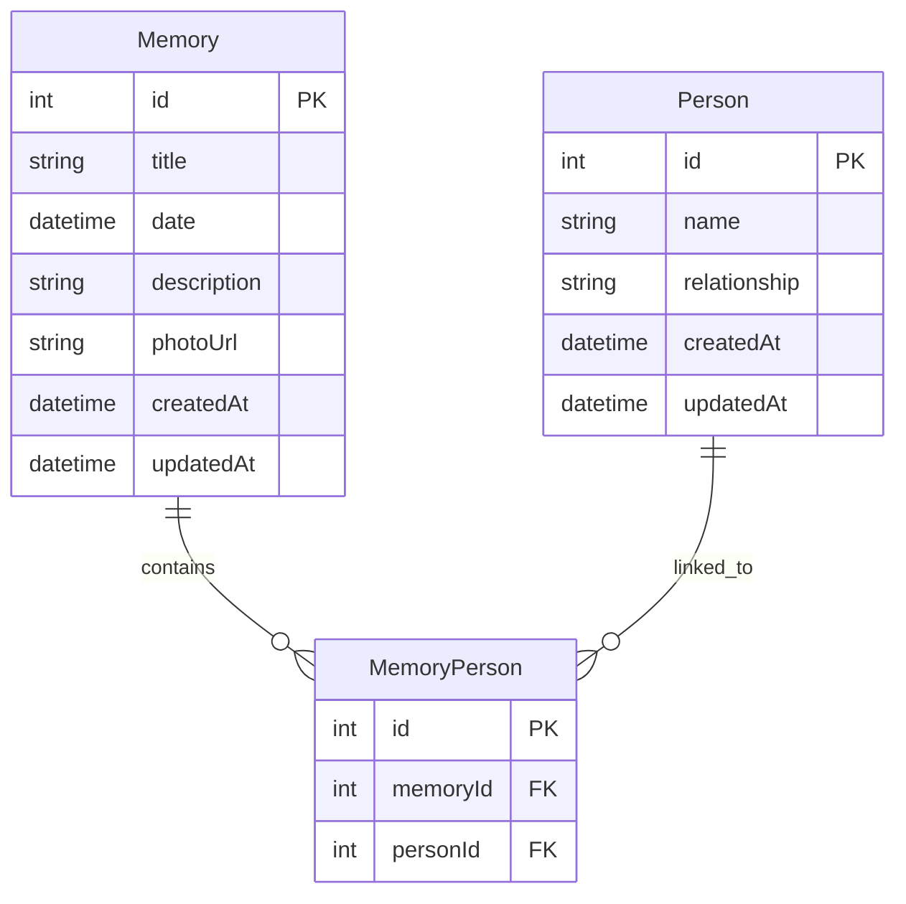

```# Good Day Project

This project uses a monorepo structure with separate frontend and backend applications.

## Structure

- `frontend/` - React application (Material-UI)
- `backend/` - Node.js + Express + Apollo GraphQL API

## Setup

1. Install dependencies for both apps:
   - `cd frontend && npm install`
   - `cd ../backend && npm install`
2. See each directory's README for more details.

## Development

- To run both frontend and backend concurrently from the project root:
  ```bash
  npm run dev
  ```
  This will start the React frontend and the Node.js backend together.

- The frontend is configured to proxy API requests to the backend at http://localhost:4000.
- Apollo Client is set up in the frontend to connect to the GraphQL API. You can set the API URL with the `REACT_APP_GRAPHQL_API_URL` environment variable if needed.

- You can still run frontend and backend separately in their respective directories if desired.
- Use the root `.gitignore` to exclude node_modules, build, dist, and .env files.

## Usage

To use taskmaster-ai, you can run commands like:

```bash
npx task-master-ai <command>
```

For more information about available commands and features, visit the [taskmaster-ai documentation](https://github.com/taskmaster-ai/taskmaster-ai).

## Database & Prisma ORM

This project uses [Prisma ORM](https://www.prisma.io/) with SQLite for the backend database.

### Database Location
- The SQLite database file is located at `backend/prisma/dev.db`.

### Managing the Database Schema
- The schema is defined in `backend/prisma/schema.prisma`.
- Migrations are stored in `backend/prisma/migrations/` and are automatically generated when you change the schema.

### Common Commands
- **Run migrations and update the database:**
  ```bash
  npx --prefix backend prisma migrate dev --name <migration-name> --schema=backend/prisma/schema.prisma
  ```
- **Generate the Prisma client after schema changes:**
  ```bash
  npx --prefix backend prisma generate --schema=backend/prisma/schema.prisma
  ```
- **Open the Prisma Studio (GUI for DB):**
  ```bash
  npx --prefix backend prisma studio --schema=backend/prisma/schema.prisma
  ```

### Cascade Deletes
- The `MemoryPerson` table uses `ON DELETE CASCADE` for both `memoryId` and `personId` foreign keys.
- Deleting a `Person` or `Memory` will automatically remove related links in `MemoryPerson`.

### Migration History
- Initial migration creates all tables and relationships.
- A follow-up migration added cascade delete behavior to the `MemoryPerson` table.

## Database Schema & Relationships

### Entity-Relationship Diagram



### Table & Field Descriptions

- **Memory**: Represents a memory or event.
  - `id`: Primary key
  - `title`: Title of the memory
  - `date`: Date of the memory/event
  - `description`: Description/details
  - `photoUrl`: Link to a photo
  - `createdAt`: Timestamp when created
  - `updatedAt`: Timestamp when last updated

- **Person**: Represents a person who can be linked to memories.
  - `id`: Primary key
  - `name`: Person's name
  - `relationship`: Relationship to the user (optional)
  - `createdAt`: Timestamp when created
  - `updatedAt`: Timestamp when last updated

- **MemoryPerson**: Junction table for many-to-many relationship between Memory and Person.
  - `id`: Primary key
  - `memoryId`: Foreign key to Memory
  - `personId`: Foreign key to Person

### Relationships
- Each Memory can be linked to multiple People (via MemoryPerson).
- Each Person can be linked to multiple Memories (via MemoryPerson).
- Deleting a Memory or Person will automatically remove related links in MemoryPerson (cascade delete). 